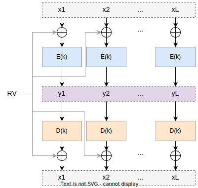

# isel-leic-seginf-g03

> Computer Security project of group 03 from LEIC51D class.

The Portuguese version of this document is available [here](README.pt.md).

## Authors

- [48089 André Páscoa](https://github.com/devandrepascoa)
- [48280 André Jesus](https://github.com/andre-j3sus)
- [48287 Nyckollas Brandão](https://github.com/Nyckoka)

Professor: Eng. José Simão

@ISEL 
Bachelor in Computer Science and Computer Engineering 
Computer Security - LEIC51D - Group 03 
Winter Semester of 2022/2023

---

---

## Exercises

### Exercise 1

#### 1.1

`xi = D(k)(yi) ⊕ RV`, for `i` = 1, ..., _L_, where `D` is the decryption operation, `k` is the decryption key, `XOR`
denotes the bit-wise exclusive or.

  

#### 1.2

**a)** As _RV_ is constant for all blocks, by applying _RV_ with the XOR bit operation, the patterns of the original
text will remain. This means that although the bits change, if there are blocks `xi` with equal bits, there will be no
difference in their encrypted blocks `yi`. In the case of the CBC operation mode, as the blocks `yi` are encrypted
with the previous block, if the blocks `xi` are equal, it will not be possible to detect the patterns of the original
text in the encrypted blocks `yi`.

**b)** When producing the cipher with the CBC operation mode, each encrypted block will need that the previous block
has already been encrypted, hence it is not possible to do parallelization. In the case of deciphering, it can be
parallelized because it only uses the encrypted blocks, which are already available. With this operation mode, as
_RV_ is constant, there is no dependency between the blocks, i.e. it is possible to parallelize the cipher and
decipher.

---

### Exercise 2

In the approach described in RFC 4880, the message is encrypted with a symmetric algorithm, and the symmetric key is
encrypted with an asymmetric algorithm. To encrypt the symmetric key, the recipient's public key is used. In this way,
the recipient can decrypt the encrypted symmetric key using their private key, and use it to decrypt the message.

The use of this approach is justified by the fact that the symmetric algorithm is faster than the asymmetric algorithm.
The public key is not used to encrypt the message, as this process is much slower than the use of a symmetric key. Thus,
the symmetric algorithm is used to encrypt the message since it is faster, and the symmetric key is encrypted with the
asymmetric algorithm, since it is more secure.

The encryption process is as follows:

1. The message is encrypted with a symmetric key;
2. The symmetric key is encrypted with the recipient's public key;
3. The encrypted message and symmetric key are sent to the recipient.

The decryption process of a message is as follows:

1. The message and encrypted symmetric key are received;
2. The recipient decrypts the symmetric key with their private key;
3. The recipient decrypts the message with the decrypted symmetric key.

### Exercise 3

#### 3.1

The `sign()` method of the `Signature` class is used to generate the digital signature of a document. This digital
signature is generated by encrypting the hash of the document to be signed, with the private key of the sender.
To generate the digital signature, the sender uses the `initSign(PrivateKey privateKey)` function to initialize the
digital signature process with the private key.
After this, the sender uses the `update(byte[] data)` function to update the hash of the document to be signed. Finally,
the sender uses the `sign()` function to generate the digital signature of the document of the hash calculated so far.

#### 3.2

If it is computationally feasible to obtain a new message, which produces the same hash as the original message, it
would be possible to change the message without the recipient noticing. This is because, when verifying the digital
signature, the hash extracted from the digital signature would be equal to the hash of the altered message.

---

### Exercise 4

#### 4.1

The key necessary to validate the signature of a certificate (public key of the issuer) is never present in the
certificate itself. This is because, if the public key of the issuer were present in the certificate, a new fake
certificate could be generated, containing a new public key that validates the same.
What happens in practice, is that the certificate contains the reference to the issuer, which contains the public key
used to validate the certificate signature. To validate a certificate, it is necessary to recursively validate all
certificates until reaching the root certificate, being a self-signed certificate.

#### 4.2

The MAC scheme is not used because it is necessary for the sender and receiver to have a common secret key to generate
the same. As the purpose of the certificate is for any entity to be able to verify the digital signature, it is not
possible for the sender and receiver to have a common secret key.

#### 4.3

Files of type `.cer` are used to store X.509 certificates. These files contain information about the certificate, such
as the issuer, the subscriber, the validity of the certificate, the public key, etc.
Files `.pfx` are used to store X.509 certificates and the associated private key. PFX stands for "Personal Information
Exchange".

---

### Exercise 5

The fifth exercise is implemented in the [exercise5](./src/main/kotlin/pt/isel/seginf/exercise5) folder.

---

### Exercise 6

The sixth exercise is implemented in the [exercise6](./src/main/kotlin/pt/isel/seginf/exercise6) folder.