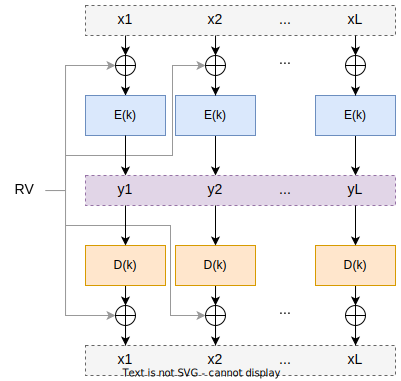

# Segurança Informática - Fase 1

> Primeira fase do projeto de Segurança Informática do grupo 03 da turma LEIC51D.

The English version of this document is available [here](README.md).

## Autores

- [48089 André Páscoa](https://github.com/devandrepascoa)
- [48280 André Jesus](https://github.com/andre-j3sus)
- [48287 Nyckollas Brandão](https://github.com/Nyckoka)

Professor: Eng. José Simão

@ISEL 
Licenciatura em Engenharia Informática e de Computadores 
Segurança Informática - LEIC51D - Grupo 03 
Semestre de Inverno 2022/2023

---

---

## Exercícios

### Exercício 1

#### 1.1

`xi = D(k)(yi) ⊕ RV`, para `i` = 1, ..., _L_, onde `D` é a operação de decifra, `k` é a chave de decifra, `⊕` denota o
ou-exclusivo bit a bit.

  

#### 1.2

**a)** Como _RV_ é constante para todos os blocos, ao aplicar _RV_ com a operação XOR bit a bit, os padrões do texto
original vão manter-se. Isto significa que apesar de os bits mudarem, caso existam blocos `xi` com bits iguais, não
haverá diferença nos seus blocos `yi` cifrados. No caso do modo de operação CBC, como os blocos `yi` são cifrados
com o bloco anterior, se os blocos `xi` forem iguais, não será possível detetar os padrões do texto original nos blocos
`yi` cifrados.

**b)** Ao produzir a cifra com o modo de operação CBC, cada bloco cifrado vai necessitar que o bloco anterior já tenha
sido cifrado, daí não ser possível fazer paralelização. No caso da decifra, é possível ser paralelizada porque apenas
usa os blocos cifrados, que já estão disponíveis. Com este modo de operação, como _RV_ é constante, não existe
dependência entre os blocos, ou seja, é possível paralelizar a cifra e decifra.

---

### Exercício 2

Na abordagem descrita no RFC 4880, a mensagem é cifrada com um algoritmo simétrico, e a chave simétrica é cifrada com
um algoritm assimétrico. Para cifrar a chave simétrica, é usada a chave pública do destinatário. Desta forma, o
destinatário pode decifrar a chave simétrica cifrada usando a sua chave privada, e usa esta para decifrar a mensagem.

A utilização desta abordagem é justificada pelo facto de o algoritmo simétrico ser mais rápido que o algoritmo
assimétrico. Não é utilizada a chave pública para cifrar a mensagem, pois este processo é muito mais lento do que a
utilização de uma chave simétrica. Assim, o algoritmo simétrico é usado para cifrar a mensagem visto que é mais
rápido, e a chave simétrica é cifrada com o algoritmo assimétrico, visto que é mais seguro.

O processo de cifra é o seguinte:

1. A mensagem é cifrada com uma chave simétrica;
2. A chave simétrica é cifrada com a chave pública do destinatário;
3. A mensagem e a chave simétrica cifradas são enviadas para o destinatário.

O processo de decifra de uma mensagem é o seguinte:

1. A mensagem e a chave simétrica cifradas são recebidas;
2. O destinatário decifra a chave simétrica com a sua chave privada;
3. O destinatário decifra a mensagem com a chave simétrica decifrada.

### Exercício 3

#### 3.1

O método `sign()` da class `Signature` é usado para gerar a assinatura digital de um documento. Esta assinatura digital
é gerada ao cifrar o hash do documento a ser assinado, com a chave privada do emissor.
Para gerar a assinatura digital, o emissor utiliza a função `initSign(PrivateKey privateKey)` para inicializar o
processo de assinatura digital com a chave privada.
Após isto, o emissor utiliza a função `update(byte[] data)` para atualizar o hash do documento a ser assinado. Por fim,
o emissor utiliza a função `sign()` para gerar a assinatura digital do documento do hash calculado até ao momento.

#### 3.2

Caso seja computacionalmente fazível obter uma nova mensagem, que produza o mesmo hash que a mensagem original, seria
possível alterar a mensagem sem que o recetor percebesse. Isto porque, ao verificar a assinatura digital, a hash
extraída da assinatura digital seria igual ao hash da mensagem alterada.

---

### Exercício 4

#### 4.1

A chave necessária para validar a assinatura de um certificado (chave pública do emissor) nunca está presente no
próprio certificado. Isto porque, caso a chave pública do emissor estivesse presente no certificado, poderia ser gerado
um novo certificado falso, contendo uma nova chave pública que valida o mesmo.
O que acontece na prática, é que o certificado contém a referência para o emissor, que contém a chave pública usada
para validar a assinatura do certificado. Para validar um certificado é necessário validar recursivamente todos os
certificados até chegar ao certificado raiz, sendo um certificado autoassinado.

#### 4.2

O esquema MAC não é utilizado por ser necessário que o emissor e o recetor tenham uma chave secreta em comum para gerar
o mesmo. Como o objetivo do certificado é que qualquer entidade possa verificar a assinatura digital, não é possível que
o emissor e o recetor tenham uma chave secreta em comum.

#### 4.3

Ficheiros do tipo `.cer` são usados para armazenar certificados X.509. Estes ficheiros contêm informação sobre o
certificado, como o emissor, o assinante, a validade do certificado, a chave pública, etc.
Ficheiros `.pfx` são usados para armazenar certificados X.509 e a chave privada associada. PFX significa "Personal
Information Exchange".

---

### Exercício 5

O quinto exercício está implementado na diretoria [exercise5](../../src/main/kotlin/pt/isel/seginf/trab1/ex5).

---

### Exercício 6

O sexto exercício está implementado na diretoria [exercise6](../../src/main/kotlin/pt/isel/seginf/trab1/ex6).
